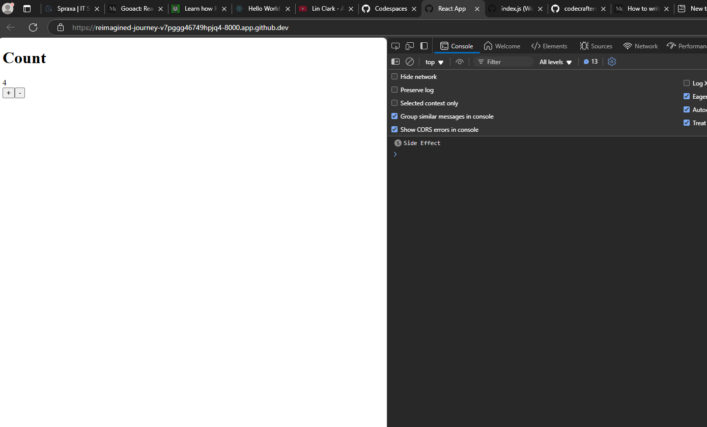

# MyReact
Tried to create a React library from scratch.

Here, I tried to reverse engineer the core React feature like Functional Component and useState hook. MyReact library has a custom createElement function which is called when transpiling the JSX, it also has a custom render which will render the JSX into the parent/root DOM element.
I refer to the following resources while creating this

[WTF is JSX](https://jasonformat.com/wtf-is-jsx/)

[Build your own React](https://pomb.us/build-your-own-react/)

I am using Babel for tranpiling the index.js file, after transpiling tranpiled.js file is created which is linked to the index.html file.

# Try MyReact by your own

Setup the app by :

``` 
yarn install
```
Write your MyReact _(it is just like React)_ code to the index.js file and then run the following command, then to transpile the MyReact code run the following command:

```
yarn build
```

After that just open the index.html file in the browser


